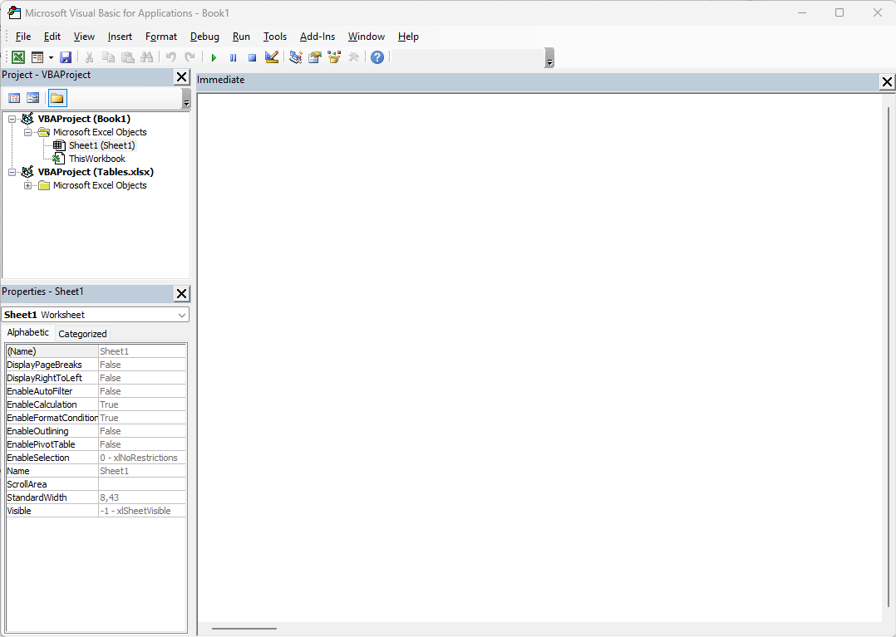

# Getting Started

This page describes how to use the built-in Visual Basic for Applications Editor in any Microsoft Office application.

## The Visual Basic for Applications Editor

- Launch any Microsof Office application, like Microsoft Excel.
- Press <kbd>Alt</kbd>+<kbd>F11</kbd> to run the VBA Editor.

This runs the VBA Editor.



You need to become familiar with this Editor.
You can see that there is a several nodes under which code can be added. Either at the Workbook level, or at the level of each Worksheet.

You can also create standalone Modules to host helper code that is not directly tied to a single document or application for instance.

## Your First Module

- In the **Project** pane, right-click on the VBA Project and select **Insert|Module**.
- In the **Properties** pane, rename `Module1` to the name of more meaningful name, like `modSample`.
- In the **Tools|Options** menu, uncheck the **Auto Syntax Check** option. This will help you write code without being interrupted by the pesky compiler. You will still need to make sure the code is valid before running the project.
- Write the following code in the module:

```basic
Public Sub Sample()

    Let nCount = ThisWorkbook.Worksheets.Count
    Let nIndex = 1
    For nIndex = 1 To nCount
        Set ws = ThisWorkbook.Worksheets.Item(nIndex)
        MsgBox ws.Name
    Next

End Sub
```


Alternatively, you can import an existing module:

- Right-click on the VBA Project and select **Import file…**.
- Locate and import the [modules/01-modSample.bas](modules/01-modSample.bas) module file.

Whenever you write some code, you need to check that the code is valid. Select the **Debug|Compile VBA Project**.

If there are no errors, run the `Sample` subroutine by clicking on the green **Run Macro (F5)** arrow (or press <kbd>F5</kbd>).

## Understanding Visual Basic

### Declaring a Sub or a Function

Most programming languages have _methods_ or _functions_.
VBA makes the distinction between _Function_ which have a return value
and _Sub_ which do not.

A _Public Sub_ is also called a _Macro_ and can be run directly or
used as a formula in Excel, for instance.

```bas
Public Sub SubName()
  ' this is a comment
  ' that subroutine does not return anything
End Sub
```

By contrast a _Function_ has a return value. Thus, it must
be declared with its return type. Most programming languages
have the _return_ keyword to exit from he function with a return value.
Instead, in VBA you assign the return value to the function name.
You also need to exit from the function if you do not want the processing
to continue after the return value.

```bas
Private Function FunctionName() As String
  ' this is a comment
  ' that function returns a string
  FunctionName = "The return value"
  Exit Function

  ' this part will never run
  ' Exit Function is not needed if
  ' the return value is the last statement

End Function
```

**Note** that the `FunctionName` _Function_ in the previous example
is declared _Private_. This means that it can only be called from
within the module where it is declared. As a good practice, do not
unnecessarily "expose" implementation details to the outside world.

### Calling a Sub or a Function

Calling a _Sub_ is done with its name, followed by its parameters,
without parentheses.

```bas
SubName 'this invoke the Sub
MsgBox "Hello, World!"
```

Calling a _Function_, by contrast, using the parentheses to wrap
its input parameters. You must use the return value, either by
assigning it to a variable, or passing it as a parameter to another
_Function_ or _Sub_.

```
Split("a|b|c", "|") ' Syntax Error
Let array = Split('a|b|c", "|") ' OK
```