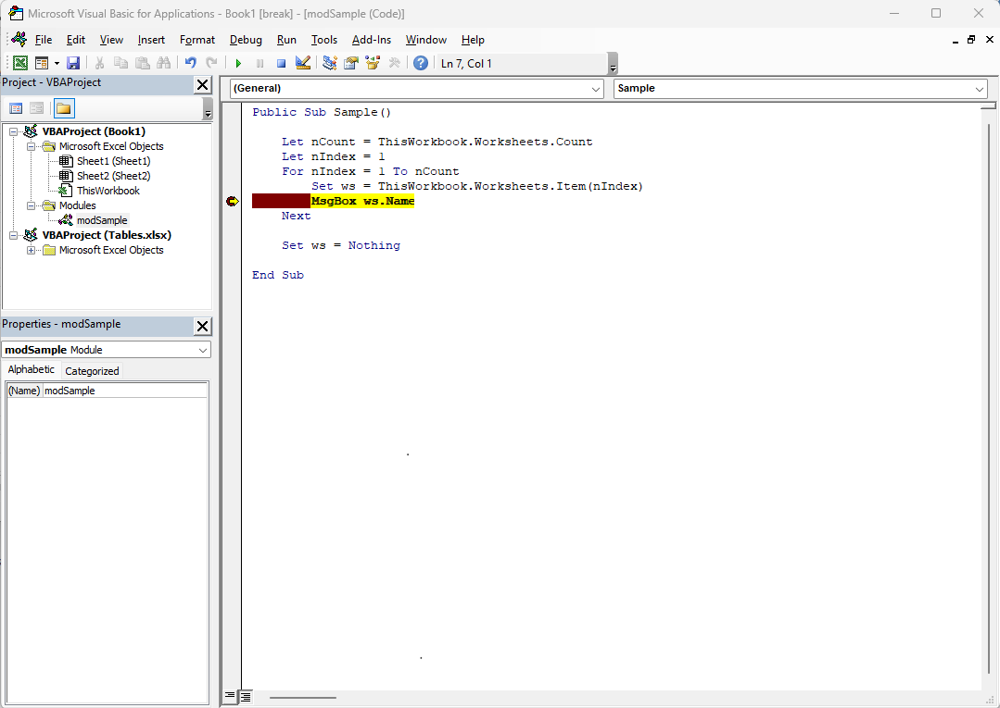
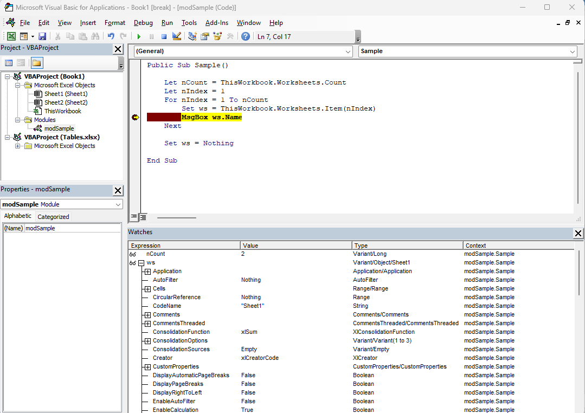

# Debugging

Debugging can be useful to troubleshoot a program.
In this page, you will learn to debug your first module.

**Prerequisites**: please, follow the [Getting Started](01-GettingStarted.md) page first.

## Setting a breakpoint

In any module, press <kbd>F9</kbd> to set a breakpoint.
This will stop the program in the Debugger and allow you to inspect the value of variables used in your program.

- In the `modSample` code, locate and set a breakpoint at the following line:

```basic
MsgBox ws.Name
```

- Then press the green arrow or <kbd>F5</kdb> to run the program.



## Using the Watch Window

You can hover the mouse over the variables to see their values.
But a better way is to use the **View|Watch Window**.

- Right-click on the `nCount` variable in the code, and select **Add Watch…**.
- Likewise, right-click on the `ws` variable in the code, and select **Add Watch…**.



## Using the Immediate Window

The **View|Immediate Window** allows you to run code interactively.

- In the Immediate Window type the following instructions (hit <kbd>Enter</kbd> to run the code)

```basic
Debug.Print nCount
Debug.Print ws.Name
```

**Note**: in the Watch Window, notice that `nCount` is displayed in
a single line. Its Type is `Variant/Long`. This is one of the 
_Value Types_ – also known as a _Scalar Value_. By contrast, the `ws` variable Type is `Variant/Object/Sheet1`. This designates an _Object Type_.

The distinction between _Scalar_ and _Objects_ is important.
In the next section you will learn more about those concepts.

Click on the blue square Reset button to stop the Debugger.